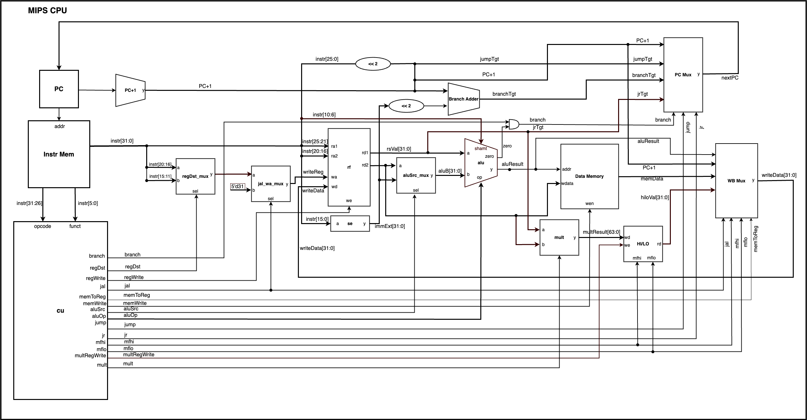

# CPU Design

**Goals**: Design and implement a complete software CPU in C/C++, including its architecture, ISA, emulator, assembler, and demo programs.

## Demo Videos

Demo recordings of the programs running on the CPU emulator are available in the [`demo_videos/`](demo_videos/) folder:

- [`demo_videos/Factorial-demo-video.mp4`](demo_videos/Factorial-demo-video.mp4) — recursive factorial demo
- [`demo_videos/FibonacciVideo.mp4`](demo_videos/FibonacciVideo.mp4) — iterative fibonacci demo

## Setup

Before running demo programs we have to compile the emulator and assemble the program binaries

> Requires C++17 and CMake 3.16+.

### Emulator

Configure the project (generates build files) and compile all executables:
  ```bash
  cmake -B build && cmake --build build
  ```

### Assemble programs

Assemble the demo programs into runnable binaries

1. Assemble Hello World program
```bash
./build/assembler programs/hello.asm -o programs/hello.bin
```

2. Assemble Fibonacci program
```bash
./build/assembler programs/fibonacci.asm -o programs/fibonacci.bin
```

3. Assemble Factorial recursive program
```bash
./build/assembler programs/recursive.asm -o programs/recursive.bin
```

Optionally:

Print a hex listing to stdout instead of writing a binary file:
  ```bash
  ./build/assembler programs/hello.asm --hex
  ```

### Run demo programs

1. Hello World:
```bash
./build/emulator programs/hello.bin
```

2. Fibonacci:
```bash
./build/emulator programs/fibonacci.bin           # default n=4, prints 4 terms
./build/emulator programs/fibonacci.bin --arg 10  # n=10, prints 10 terms
```

3. Factorial (recursive):
```bash
./build/emulator programs/recursive.bin           # default n=4, fact(4) = 24
./build/emulator programs/recursive.bin --arg 6   # n=6, fact(6) = 720
```

## Debug

Helpful debugging commands

Run programs in debug mode:
  ```bash
  ./build/emulator programs/recursive.bin --debug

  ./build/emulator programs/recursive.bin --debug --arg 6
  ```

Each cycle writes CPU state to `tmp/debug.json` — registers, memory, PC, and current instruction in decimal/hex/binary.

Dump register contents after execution:
  ```bash
  ./build/emulator programs/recursive.bin --dump-regs
  ```

Dump memory contents after execution:
  ```bash
  ./build/emulator programs/recursive.bin --dump-mem
  ```

Run with a cycle limit:

```bash
./build/emulator programs/hello.bin --max-cycles 1000
```

## Tests

Run all tests:
  ```bash
  ctest --test-dir build --output-on-failure
  ```

Run a single test by name:
  ```bash
  ctest --test-dir build -R test_alu
  ```


## Design

The CPU is built bottom-up from digital logic gates through to a full single-cycle MIPS pipeline. Each layer depends only on the one below it: gates → flip-flops → registers → memory → datapath → control unit → CPU.



Each instruction completes in one cycle: **Fetch → Decode → Execute → Memory → Writeback**. The assembler compiles `.asm` source into a flat binary (`.bin`) which the emulator loads directly into the CPU's instruction memory.

**Key design decisions:**
> - The CPU is **32-bit** (32 GPRs, 32-bit words, 4096-word address space). Low-level primitives (flip-flops, standalone registers) default to 16-bit unless configured otherwise.
> - All binary values are represented by `std::vector<bool>` with **index 0 as MSB** (most significant bit) and **last index as LSB** (least significant bit)
> - Memory is **word-addressed** (each address refers to a 32-bit word, not a byte)

### ISA

| Type    | Instructions |
|---------|-------------|
| R-type  | `add`, `addu`, `sub`, `and`, `or`, `xor`, `nor`, `slt`, `sll`, `srl`, `sra`, `mult`, `multu`, `mfhi`, `mflo`, `jr`, `jalr` |
| I-type  | `addi`, `slti`, `andi`, `ori`, `xori`, `lui`, `lw`, `sw`, `beq`, `bne` |
| J-type  | `j`, `jal` |
| Special | `halt` |
| Pseudo  | `li`, `move` *(expanded by the assembler, not real instructions)* |

`mult`/`multu` store the 64-bit product in the HI/LO register pair. Use `mfhi`/`mflo` to move the result into a general-purpose register.

#### Instruction Encoding

```
R-type:  [ opcode(6) | rs(5) | rt(5) | rd(5) | shamt(5) | funct(6) ]
I-type:  [ opcode(6) | rs(5) | rt(5) |        imm(16)              ]
J-type:  [ opcode(6) |               target(26)                    ]
```

All instructions are 32-bit. Index 0 is MSB throughout.

**Opcodes** (I-type and J-type; R-type always `0x00`)

| Mnemonic | Opcode | Mnemonic | Opcode |
|----------|--------|----------|--------|
| `j`      | `0x02` | `addi`   | `0x08` |
| `jal`    | `0x03` | `slti`   | `0x0A` |
| `beq`    | `0x04` | `andi`   | `0x0C` |
| `bne`    | `0x05` | `ori`    | `0x0D` |
| `lw`     | `0x23` | `xori`   | `0x0E` |
| `sw`     | `0x2B` | `lui`    | `0x0F` |
| `halt`   | `0x3F` |          |        |

**Funct codes** (R-type only)

| Mnemonic | Funct  | Mnemonic | Funct  |
|----------|--------|----------|--------|
| `sll`    | `0x00` | `mult`   | `0x18` |
| `srl`    | `0x02` | `multu`  | `0x19` |
| `sra`    | `0x03` | `mfhi`   | `0x10` |
| `jr`     | `0x08` | `mflo`   | `0x12` |
| `jalr`   | `0x09` | `add`    | `0x20` |
| `addu`   | `0x21` | `sub`    | `0x22` |
| `and`    | `0x24` | `or`     | `0x25` |
| `xor`    | `0x26` | `nor`    | `0x27` |
| `slt`    | `0x2A` |          |        |

#### Special Registers

| Register | Index | Role |
|----------|-------|------|
| `$zero`  | 0     | Hardwired 0 — writes discarded |
| `$at`    | 1     | Assembler temporary |
| `$sp`    | 29    | Stack pointer — initialised to `0xFEF`, grows downward |
| `$fp`    | 30    | Frame pointer |
| `$ra`    | 31    | Return address — written by `jal` |

#### Memory Map

| Range           | Region | Description |
|-----------------|--------|-------------|
| `0x000`–`0x7FF` | TEXT   | Program code |
| `0x800`–`0xEFF` | DATA   | Static data / strings |
| `0xF00`–`0xFEF` | STACK  | Grows downward; `$sp` starts at `0xFEF` |
| `0xFFE`         | MMIO   | Read character from stdin |
| `0xFFF`         | MMIO   | Write character to stdout |


## Project Structure

- **assembler/** - Assembler frontend and implementation.
  - `main.cpp` parses CLI arguments
  - `lexer.*`, `parser.*`, `encoder.*` implement the two-pass assembly pipeline
  - `assembler.*` exposes file assembly and binary writing helpers
- **emulator/** - Emulator entrypoint and binary loader.
  - `main.cpp` runs compiled programs on the CPU model
  - `loader.*` reads `.bin` program images into memory
  - `debug.*` — interactive step-through debug loop; writes state to `tmp/debug.json`
- **cpu/** - CPU core implementation.
  - `isa.h` — opcode/funct enums and instruction struct
  - `control_unit.*` — decodes instructions and drives datapath control signals
  - `cpu.*` — top-level single-cycle CPU wiring (fetch → decode → execute → memory → writeback)
  - `mmio.*` — memory-mapped I/O (stdin at `0xFFE`, stdout at `0xFFF`)
  - `config.h` — word size, memory map constants, register aliases
- **datapath/** - Arithmetic and logic datapath components.
  - ALU (`alu.*`) — ADD, SUB, AND, OR, XOR, NOR, SLT, SLL, SRL, SRA, MULT
  - Adders (`adders.*`) — ripple-carry adder
  - Bitwise operations (`bitwise.*`)
  - Shifters (`shifter.*`) — logical left/right shifters used by ALU
  - Multiplier (`multiplier.*`) — 32×32 → 64-bit shift-and-add multiplier (feeds HI/LO registers)
  - Multiplexers (`mux.*`), sign/zero extenders (`sign_extend.*`), register file (`regfile.*`)
- **memory/** - Storage primitives and memory model.
  - Flip-flops, registers, and word-addressable memory
- **gates/** - Basic logic gates used by higher-level modules
- **clock/** - Clock-cycle management utilities
- **utils/** - Shared helpers for bit/vector conversions and other support code
- **programs/** - Example assembly source programs and prebuilt `.bin` outputs
  - `hello.asm` — prints a string via MMIO
  - `fibonacci.asm` — iterative Fibonacci sequence
  - `recursive.asm` — recursive function call example (uses `jal`/`jr`, stack)
- **demos/** - Standalone C and C++ demo programs
- **tests/** - Unit tests grouped by subsystem
  - ALU, memory, registers, clock, gates, and utility tests
- **docs/** - Architecture references and generated documentation
  - `mips_cpu_schematic.png` / `mips_cpu_schematic.drawio` — CPU architecture diagram (editable draw.io source)
  - `MIPS_Reference_Data_Card.pdf` — MIPS ISA reference
- **build/** - Local build output directory generated by CMake

## Team Members

- Purav
- Daniel Cai
- Sabari Duraipandian
- Simul Barua
